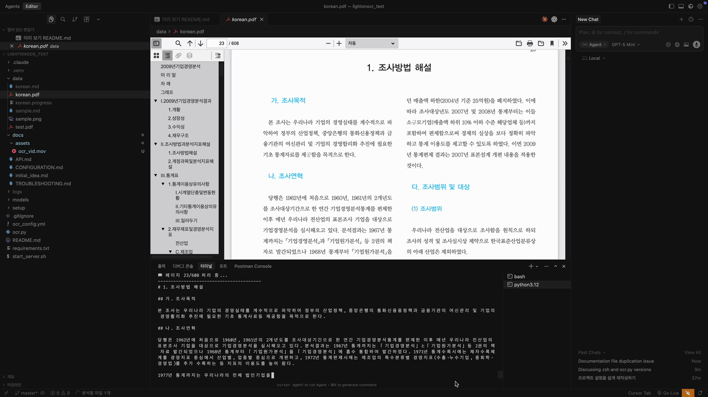
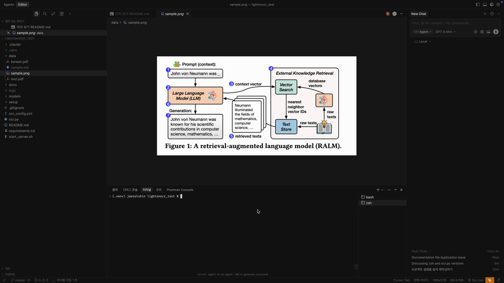

# LightOnOCR

로컬에서 실행 가능한 경량 OCR 엔진으로, 이미지와 PDF에서 텍스트를 추출합니다. LightOnOCR 모델과 Qwen3-VL 모델을 모두 지원하며, 사용 사례에 맞게 선택할 수 있습니다.

### PDF OCR 데모



### PNG OCR 데모



## 시스템 요구사항

- **OS**: macOS 12.0 이상
- **프로세서**: Apple Silicon (M1/M2/M3 이상)
- **메모리**: 8GB 이상 (권장: 16GB)
- **저장공간**: 10GB 이상 (모든 모델 포함 시 12GB)

## 빠른 시작

### 1단계: 초기 설정 (5분)

```bash
# 프로젝트 클론
git clone https://github.com/yourusername/lightonocr_test.git
cd lightonocr_test

# 자동 설치 (첫 실행 시 필수)
./setup/setup_macos.sh
```

첫 실행 시 필요한 모델을 자동으로 다운로드합니다 (약 2GB, 5-10분 소요).

### 2단계: 서버 시작

```bash
# 모든 서버 시작
./manage_servers.sh start

# 또는 특정 서버만 시작
./manage_servers.sh start lightonocr    # LightOnOCR만
./manage_servers.sh start qwen3         # Qwen3-VL만
./manage_servers.sh start minicpm       # MiniCPM-V만
```

### 3단계: OCR 실행

```bash
# 가상환경 활성화 (처음 한 번만)
source .venv/bin/activate

# 이미지 OCR
python ocr.py image.png

# PDF OCR
python ocr.py document.pdf

# 특정 모델 사용
python ocr.py --model qwen3 image.png
```

결과는 자동으로 `.md` 파일로 저장됩니다.

## 서버 관리

### 통합 스크립트 사용

```bash
# 모든 서버 시작
./manage_servers.sh start

# 모든 서버 종료
./manage_servers.sh stop

# 모든 서버 재시작
./manage_servers.sh restart

# 서버 상태 확인
./manage_servers.sh status

# 특정 서버만 제어
./manage_servers.sh start lightonocr
./manage_servers.sh stop qwen3
./manage_servers.sh restart minicpm
```

### 로그 위치

```
logs/
├── lightonocr_server.log
├── qwen3_server.log
└── minicpm_server.log
```

## OCR 모델 비교

| 특징 | LightOnOCR (1B) | Qwen3-VL (8B) | MiniCPM-V (4B) |
|------|-------------------|-----------------|------------------|
| 모델 크기 | 1.2GB | 8.7GB | 3.5GB |
| 처리 속도 | 매우 빠름 | 보통 | 빠름 |
| 정확도 | 우수 | 탁월 | 탁월 |
| 컨텍스트 | 8K 토큰 | 32K-256K 토큰 | 16K 토큰 |
| 특화 영역 | 일반 텍스트 | 차트, 다이어그램, 수식 | 다양한 문서 |
| 메모리 요구 | 4GB | 16GB | 8GB |
| 포트 | 8080 | 8081 | 8082 |
| 상태 | 기본 | 권장 | 추가 |

### 모델 선택 가이드

**LightOnOCR 사용을 권장하는 경우:**
- 단순한 텍스트 문서
- 빠른 처리가 필요할 때
- 메모리가 제한적일 때 (4GB 이상)
- 대량 일괄 처리

**Qwen3-VL 사용을 권장하는 경우:**
- 복잡한 레이아웃 (학술 논문, 보고서)
- 차트, 그래프, 다이어그램 포함
- 수식이나 특수 기호가 많을 때
- 높은 정확도가 중요할 때
- 긴 문서 (수백 페이지)

**MiniCPM-V 사용을 권장하는 경우:**
- 일반적인 문서 처리
- Qwen3-VL보다 빠른 속도 필요
- 중간 정도의 정확도 필요
- 메모리가 어느 정도 제한적일 때

## OCR 실행 옵션

### 기본 사용법

```bash
# 이미지에서 텍스트 추출
python ocr.py photo.jpg
# → photo.md 파일로 저장

# PDF 문서 처리
python ocr.py document.pdf
# → document.md 파일로 저장
```

### 주요 옵션

```bash
# 모델 선택
python ocr.py --model qwen3 image.png
# lightonocr (기본), qwen3, minicpm 중 선택

# 조용한 모드 (화면 출력 최소화)
python ocr.py --quiet document.pdf

# 파일 저장 없이 화면 출력만
python ocr.py --no-save document.pdf

# 통계 표시
python ocr.py --stats document.pdf

# 오류 건너뛰고 계속 진행 (PDF)
python ocr.py --skip-errors book.pdf

# 중단된 작업 이어서 하기 (PDF)
python ocr.py --resume large_document.pdf
```

## 설정 파일

### 설정 파일 생성

```bash
# 기본 설정 파일 생성
python ocr.py --create-config ocr_config.yml
```

### 설정 파일 사용

```bash
# 설정 파일로 실행
python ocr.py -c ocr_config.yml document.pdf
```

### 설정 파일 예시

```yaml
# ocr_config.yml
ocr:
  model: qwen3          # lightonocr, qwen3, minicpm
  streaming: true       # 실시간 스트리밍
  save_mode: "token"    # 저장 모드
  save_file: true       # 파일 저장
  quiet: false          # 조용한 모드

pdf:
  skip_errors: true     # 오류 페이지 건너뛰기
  max_retries: 2        # 재시도 횟수

api:
  timeout: 300          # 타임아웃 (초)
```

## 활용 예시

### 스캔한 문서를 텍스트로 변환

```bash
python ocr.py scanned_document.pdf
```

### 스크린샷에서 텍스트 복사

```bash
python ocr.py screenshot.png --no-save
# 화면에 나온 텍스트를 복사
```

### 대용량 PDF 처리

```bash
# 오류가 나도 계속 진행
python ocr.py --skip-errors large_book.pdf

# 중간에 멈췄다면 이어서 진행
python ocr.py --resume large_book.pdf
```

### 두 모델 성능 비교

```bash
# 모델별로 동시에 OCR 실행
./manage_servers.sh start all
python ocr.py --model lightonocr simple_image.png
python ocr.py --model qwen3 complex_image.png
```

## API 연동

### Python으로 연동

```python
import base64
import httpx

def ocr_image(image_path, model='lightonocr', port=8080):
    with open(image_path, "rb") as f:
        image_base64 = base64.b64encode(f.read()).decode()

    response = httpx.post(
        f"http://localhost:{port}/v1/chat/completions",
        json={
            "model": "LightOnOCR-1B-1025" if model == 'lightonocr' else model,
            "messages": [{
                "role": "user",
                "content": [
                    {"type": "text", "text": "Extract all text from this image."},
                    {"type": "image_url", "image_url": {
                        "url": f"data:image/jpeg;base64,{image_base64}"
                    }}
                ]
            }],
            "temperature": 0.1,
            "max_tokens": 4096
        }
    )
    return response.json()["choices"][0]["message"]["content"]

# 사용 예시
text = ocr_image("document.pdf")
print(text)
```

### curl로 직접 호출

```bash
# 헬스 체크
curl http://localhost:8080/health

# 모델 정보
curl http://localhost:8080/v1/models

# LightOnOCR 사용
curl -X POST http://localhost:8080/v1/chat/completions \
  -H "Content-Type: application/json" \
  -d '{
    "model": "LightOnOCR-1B-1025",
    "messages": [{"role": "user", "content": "Extract text"}]
  }'

# Qwen3-VL 사용
curl -X POST http://localhost:8081/v1/chat/completions \
  -H "Content-Type: application/json" \
  -d '{
    "model": "Qwen3VL-8B-Thinking",
    "messages": [{"role": "user", "content": "Extract text"}]
  }'
```

## 고급 설정

### 환경 변수

```bash
# 기본 포트 설정 변경
export LIGHTONOCR_PORT=9000
export QWEN3_PORT=9001

# 로그 레벨 설정
export LOG_LEVEL=DEBUG

# 모델 캐시 위치
export MODEL_CACHE_DIR=/custom/path
```

### 성능 최적화

```bash
# GPU 메모리 사용량 조정
CUDA_VISIBLE_DEVICES=0 python ocr.py image.png

# 병렬 처리 수 조정
python ocr.py --parallel 4 document.pdf

# 배치 크기 조정
python ocr.py --batch-size 2048 document.pdf
```

## 문제 해결

### 서버가 시작되지 않을 때

```bash
# 포트 사용 상황 확인
lsof -i :8080

# 기존 프로세스 종료
./manage_servers.sh stop

# 서버 로그 확인
tail -f logs/lightonocr_server.log
```

### OCR이 느릴 때

```bash
# 1. GPU 가속 확인 (로그에서 "Metal" 또는 "MPS" 찾기)
tail logs/lightonocr_server.log | grep -i metal

# 2. 더 빠른 모델 사용 (LightOnOCR)
python ocr.py --model lightonocr image.png

# 3. 메모리 확인
top -l 1 | grep PhysMem
```

### 모델 다운로드 실패

```bash
# 수동 다운로드
./setup/download_qwen3.sh
./setup/download_minicpm.sh

# 또는 직접 다운로드
mkdir -p models
cd models
llama-cli -hf ggml-org/LightOnOCR-1B-1025-GGUF
```

### 메모리 부족 에러

```bash
# 더 작은 모델 사용
python ocr.py --model lightonocr document.pdf

# 또는 더 낮은 양자화 버전 사용
# start_server.sh에서 모델 경로 변경
# ggml-model-Q4_0.gguf 사용 (더 빠름, 더 적은 메모리)
```

### CUDA/Metal 에러

```bash
# llama.cpp 재설치
brew uninstall llama.cpp
brew install llama.cpp

# 또는 직접 설치
git clone https://github.com/ggml-org/llama.cpp.git
cd llama.cpp
make -j$(nproc)
```

## 파일 구조

```
lightonocr_test/
├── README.md                    # 이 파일
├── manage_servers.sh            # 서버 통합 관리 스크립트
├── ocr.py                       # OCR 실행 스크립트
├── ocr_config.yml              # 설정 파일
├── requirements.txt            # Python 의존성
│
├── setup/
│   ├── setup_macos.sh          # macOS 초기 설정
│   ├── download_qwen3.sh       # Qwen3-VL 모델 다운로드
│   └── download_minicpm.sh     # MiniCPM-V 모델 다운로드
│
├── models/                      # 모델 파일 (자동 다운로드)
│   ├── ggml-model-Q8_0.gguf
│   ├── Qwen3VL-8B-Thinking-Q8_0.gguf
│   └── [vision encoder 파일들]
│
├── logs/                        # 로그 파일
│   ├── lightonocr_server.log
│   ├── qwen3_server.log
│   └── minicpm_server.log
│
├── docs/                        # 문서
│   ├── assets/                  # 데모 이미지/영상
│   ├── ADVANCED.md             # 고급 설정
│   ├── API.md                  # API 문서
│   ├── CONFIGURATION.md        # 설정 옵션
│   └── TROUBLESHOOTING.md      # 문제 해결
│
└── .venv/                       # Python 가상환경 (자동 생성)
```

## 의존성

### 시스템 도구
- **llama.cpp**: OCR 모델 실행 엔진
- **Python 3.12+**: 메인 프로그래밍 언어
- **poppler-utils**: PDF 처리

### Python 패키지
- **httpx**: HTTP 클라이언트
- **pyyaml**: 설정 파일 파싱
- **pdf2image**: PDF 이미지 변환
- **pillow**: 이미지 처리

## 라이선스

MIT 라이선스

## 관련 링크

- [llama.cpp](https://github.com/ggml-org/llama.cpp)
- [LightOnOCR 모델](https://huggingface.co/ggml-org/LightOnOCR-1B-1025-GGUF)
- [Qwen3-VL 모델](https://huggingface.co/Qwen/Qwen3-VL-8B-Thinking-GGUF)
- [MiniCPM-V 모델](https://huggingface.co/openbmb/MiniCPM-V-4-GGUF)

## 참고 자료

- [고급 설정 가이드](docs/ADVANCED.md)
- [API 상세 문서](docs/API.md)
- [설정 파일 전체 옵션](docs/CONFIGURATION.md)
- [문제 해결 가이드](docs/TROUBLESHOOTING.md)
